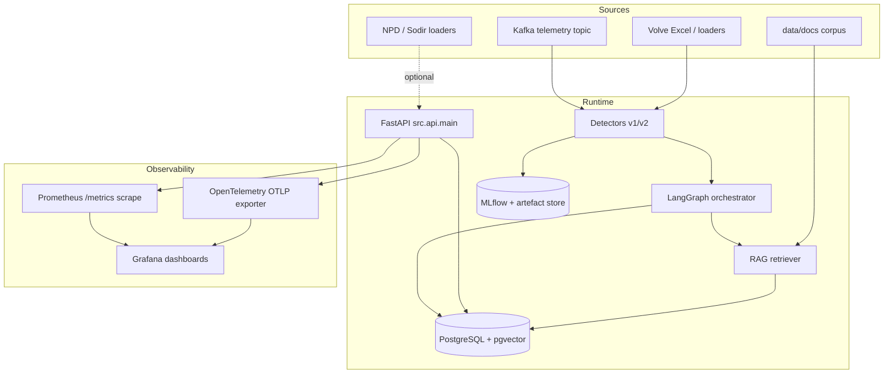
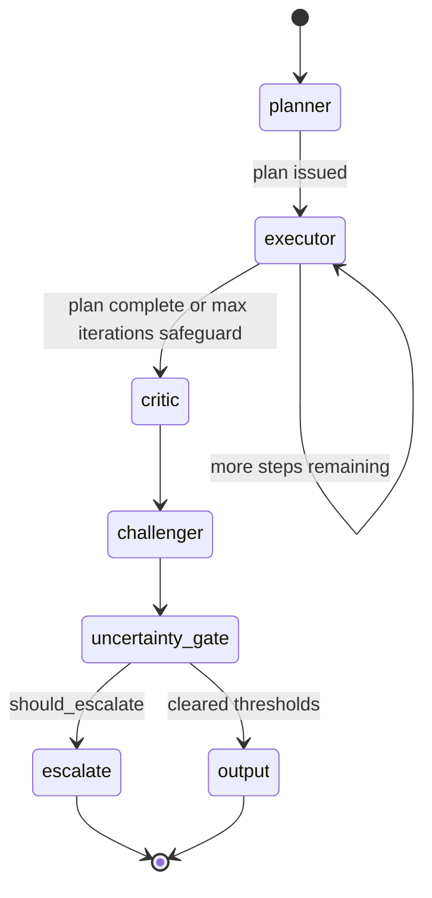
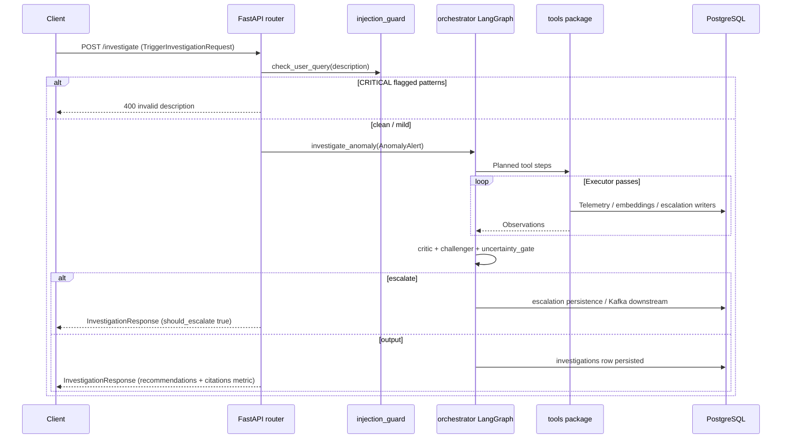

# NorthSea AgentOps — Production‑Grade Agentic AI for Offshore Operations

This **README is the canonical self‑documentation** for the repository: business context, architecture, behavioural strategies, operational flows, technical modules, governance, limitations, and how to run everything locally. **Architecture and trade-offs are consolidated here—there are no separate ADR markdown files in this repo.**

---

## How to use this document

| Audience | Jump to |
|----------|---------|
| Hiring manager / product | [Executive summary](#1-executive-summary), [Business context](#2-business-context--problem-space), [Value proposition](#26-value-proposition--business-outcomes) |
| Reservoir / production engineer | [User journeys](#3-stakeholders--user-journeys), [Detector strategy](#81-anomaly-detection-strategy-v1-vs-v2), [Glossary](#6-domain-language--glossary) |
| ML / MLOps engineer | [ML lifecycle](#82-model-lifecycle-mlflow--dvc), [Evaluation](#14-evaluation--experimentation-eval), [CI quality gates](#20-cicd-github-actions) |
| Security / compliance | [Security posture](#18-security-safety--compliance-posture), [Architectural rationale](#19-architectural-rationale-summarised) |
| Developer onboarding | [Quick start](#27-quick-start--examples), [Repository map](#12-repository-layout), [Module reference](#13-python-modules-src) |

---

## Table of contents

1. [Executive summary](#1-executive-summary)  
2. [Business context & problem space](#2-business-context--problem-space)  
3. [Stakeholders & user journeys](#3-stakeholders--user-journeys)  
4. [Scope: in / out of scope](#4-scope-in--out-of-scope)  
5. [Requirements & constraints](#5-requirements--constraints)  
6. [Domain language & glossary](#6-domain-language--glossary)  
7. [Conceptual layers (mental model)](#7-conceptual-layers-mental-model)  
8. [Anomaly detection & ML lifecycle](#8-anomaly-detection--ml-lifecycle)  
9. [Agentic investigation strategy](#9-agentic-investigation-strategy)  
10. [System architecture (diagrams)](#10-system-architecture-diagrams)  
11. [Process flows & ordering](#11-process-flows--ordering)  
12. [Repository layout](#12-repository-layout)  
13. [Python modules (`src/`)](#13-python-modules-src)  
14. [Evaluation & experimentation (`eval/`)](#14-evaluation--experimentation-eval)  
15. [Scripts & DVC pipelines](#15-scripts--dvc-pipelines)  
16. [Data governance & licences](#16-data-governance--licences)  
17. [Configuration & environment](#17-configuration--environment-variables)  
18. [Security, safety & compliance posture](#18-security-safety--compliance-posture)  
19. [Architectural rationale (summarised)](#19-architectural-rationale-summarised)  
20. [CI/CD (GitHub Actions)](#20-cicd-github-actions)  
21. [Observability & operations](#21-observability--operations-runbook-notes)  
22. [Testing strategy](#22-testing-strategy)  
23. [Honest limitations & risks](#23-honest-limitations--risks)  
24. [Roadmap](#24-roadmap)  
25. [Contributing & doc discipline](#25-contributing--documentation-discipline)  
26. [Value proposition recap](#26-value-proposition--business-outcomes)  
27. [Quick start & examples](#27-quick-start--examples)  
28. [Public HTTP API surface](#28-public-http-api-surface-overview)  

---

## 1. Executive summary

**NorthSea AgentOps** is a reference architecture and working codebase for **AI‑assisted production surveillance** on **North Sea–style offshore wells**. It connects three engineering concerns that operators usually silo:

1. **Detection** — multivariate anomalies (rates, choke, pressures, temperatures) using interpretable statistical learning, not black‑box novelty only.  
2. **Interpretation** — **agentic** workflows (Planner → Executor → **Critic** → **Challenger** → **Uncertainty Gate**) that gather evidence via tools (time series query, document RAG, diagnostic stubs) instead of hallucinating causal stories.  
3. **Governance** — escalation when uncertainty is high or risk is materially relevant; citations for document‑derived claims; observability hooks; MLflow registry and DVC for lineage.

**All RAG evaluation uses real Equinor Volve open-dataset daily production data** — not synthetic placeholders. The six producer wells (15/9-F-1 C, F-5, F-11, F-12, F-14, F-15 D) contribute 8,006 producing-day rows spanning 2008-02-12 to 2016-09-17. The RAG corpus is generated from the Excel workbook via `scripts/generate_volve_rag_corpus.py` and the 39-case golden testset from `scripts/generate_volve_golden_testset.py`.

The project is calibrated around **portfolio and interview depth** while remaining truthful about **daily public data granularity**: the architecture demonstrates how a major operator could wire agents, detectors, and safety layers; absolute detection precision on daily cells alone does not pretend to substitute sub‑daily SCADA in production KPIs ([limitations](#23-honest-limitations--risks)).

---

## 2. Business context & problem space

### 2.1 Industry backdrop

Oil and gas **offshore hubs**—platforms, subsea tie‑backs to FPSOs, electrified installations—produce under **tight HSE envelopes**, ageing brownfield declines, intermittent sand/wax/scale upset, choke management, compressor and **ESP reliability**, constraints from water handling and flare/vent limits, and **regulatory continuity** across handovers and contractors.

**Operating production surveillance** consumes significant engineering time:

- Routine review of dashboards and threshold alarms.  
- Correlating **tag data** with **reports, maintenance histories, commissioning notes, and HSE procedures**.  
- Deciding whether a deviation warrants **deferral**, **optimization**, **work order**, **shutdown**, **curtail**, or escalation to drilling/completions.

Mis‑prioritisation has direct **P&L** (undetected choke / pump issues → prolonged rate loss) and raises **major accident hazard** stakes when ambiguous situations are automated without escalation paths.

### 2.2 Core business problems addressed

These are the organisational pressures this codebase is designed **to speak to**:

| Problem | Why it hurts | Repo response |
|---------|---------------|---------------|
| **Noise / alarm fatigue** | Chronic false positives degrade trust; crews silence alarms → real events hide in plain sight | v2 **persistence + refractory** period, CUSUM for gradual drift, event‑level metrics; explicit trade‑off honesty in `eval/detector_performance_v2.json` |
| **Tacit knowledge loss** | Retiring experts held “mental models” tying tags to remedies and risk | **RAG** over ingestible corpuses + structured agent steps that surface citations |
| **Slow root‑cause brainstorming** | First‑principles RCA across documents and tags takes hours per event | Automated **investigation playbook** loop with capped iterations and escalation |
| **Black‑box “AI recommendations”** | Unexplained conclusions are unacceptable near safety‑critical envelopes | Confidence + evidence thresholds; challenger; explicit escalation reasons persisted to DB |
| **Audit pressure** | “Which model answered which alarm on which dataset?” matters after incidents | **MLflow Model Registry**, run tags, DVC pipeline stubs, Postgres persistence trails |
| **Integration reality** | SCADA historians, EH, document stores, and alerting are heterogeneous | Kafka‑shaped ingestion path (`Settings` topics), FastAPI façade, Postgres as system of record for investigations |

### 2.3 Operational story (composite, not fictional numbers)

Operators notice **rising water cut without matching choke widening**, or **BHP drifting down with GOR creeping up**. Each pattern suggests different failure modes (water breakthrough versus gas **coning** versus gauge drift). Investigation needs **historic analogues** (“when did we see comparable water‑cut ramps on neighbouring wells”) and procedures (“what is mandated sampling / verification before recommending chemical injection”).

NorthSea AgentOps encodes **that investigatory choreography**—not as a substitute for mandated procedures, but as a decision support scaffold that escalates rather than guesses when evidence is thin.

---

## 3. Stakeholders & user journeys

### 3.1 Personas

| Persona | Primary need | Typical interaction |
|---------|----------------|---------------------|
| **Production technologist / well analyst** | Fast triage, ranked hypotheses | Reviews investigation output and citations |
| **Offshore superintendent / HSE advisor** | Defensible escalation path when AI is unsure | Opens escalations from queue / tickets |
| **Data / ML engineer** | Retrain, register, rollback models | Runs `scripts/train_detector_v2.py`, MLflow transitions |
| **Platform / observability engineer** | SLOs on investigation latency | Prometheus Grafana stack |
| **Security / IAM** | Least‑privilege and traceability | Tool allowlists, audit logging |

### 3.2 User journeys (high level)

1. **Surveyance loop** — telemetry arrives (Kafka REST or simulated) → detector scores reading → anomaly record → optionally trigger investigation endpoint.  
2. **Insight loop** — operator asks `/rag/query` (or routed through ReAct for simple intents) → hybrid retrieval ranks chunks → concise answer cites sources in DB.  
3. **Remediation loop** — investigation yields recommended actions stored in Postgres; escalation creates work queue downstream (Kafka `agent.escalations` configurable).  

---

## 4. Scope (in / out of scope)

**In scope (by design)**

- Reference **detectors** trained on **real historical field data** paths (Equinor Volve), with evaluation harnesses publishing JSON metrics artefacts.  
- **Agent graphs** coordinating tools and escalation with explicit uncertainty handling.  
- **RAG** pipeline with Postgres/pgvector persistence.  
- **Safety** layers (prompt injection checks on user‑supplied descriptive text in investigation triggers, adversarial probes in CI where configured).  
- **MLOps** hooks: MLflow runs + detector registry scaffolding; DVC YAML for repeatable DAG semantics.  

**Explicitly out of scope (portfolio boundaries)**

- **Live operator SCADA adapters** proprietary to each licence—only interfaces and configs are modeled.  
- **Closed‑loop autonomous actuation** (choke moves, choke commands to DCS)—this codebase never writes back to controls.  
- **Full subsurface simulator coupling** — no Eclipse/Intersect integration; hypothetical narrative only through `ProductionOptimizer` style bridging.  

---

## 5. Requirements & constraints

### 5.1 Functional requirements (architecture‑level FRs)

| ID | Requirement | Implementation hint |
|----|-------------|---------------------|
| FR‑1 | Ingest multivariate telemetry and emit structured alerts | `WellAnomalyDetector`, `AdaptiveWellAnomalyDetector` |
| FR‑2 | Run multi‑step grounded investigation | LangGraph orchestrator (`orchestrator.py`) |
| FR‑3 | Retrieve operator knowledge grounded in citations | Hybrid RAG (`retriever.py`, `vectorstore.py`) |
| FR‑4 | Escalate on low confidence / high risk gates | `uncertainty_gate.py`, DB + optional Kafka escalation |
| FR‑5 | Track experiments and optionally register detector artefacts | MLflow integration + `model_registry.py` |

### 5.2 Non‑functional requirements (NFR targets)

These are **design targets**—tune per deployment:

| NFR | Target intent | Observability |
|-----|---------------|---------------|
| **Investigation bounded runtime** | `AGENT_TIMEOUT_SECONDS` (see `.env.example`) avoids runaway graphs | Histograms exposed via orchestrator + FastAPI timings |
| **Explainability bias** | Affected tags, anomaly types, cited docs visible in payloads | Persisted citations count in API responses |
| **Maintainability** | Cross-cutting changes documented in README + commit messages | This file and section [19](#19-architectural-rationale-summarised) |
| **Isolation** | No silent LLM‑only physics claims beyond evidence thresholds | Challenger + Gate |

---

## 6. Domain language & glossary

| Term | Meaning |
|------|---------|
| **BOPD** | Barrels of oil per day (often mapped from reservoir SM³ in public datasets using fixed conversion conventions in loaders). |
| **Water cut** | Share of liquid volume that is produced water—influences separation, pumping, corrosion, polymer demand. |
| **GOR / GLR** | Gas‑oil ratio style signals reflecting breakthrough, liberation, choke effects, metering issues. |
| **Choke / 64ths** | Restrictor opening—primary short‑timescale production control observable on surfaces. |
| **BHP** | Bottom‑hole referenced pressure analogue in daily exports—drops can signal depletion/inflow/skin/pump impairment contextually. |
| **ESP** | Electrical submersible pump—bearing wear and gas locking affect rate stability; RUL‑style narration is illustrative in codebase. |
| **FPSO / platform surveillance** | This solution models **surveillance** not **control**. |
| **HSE** | Health, Safety, Environment—escalations align morally with “better false positives on critical uncertainty than invisible wrong confidence.” |

---

## 7. Conceptual layers (mental model)

```text
Layer 7  Human escalation & workflow tools (ticket systems — external)
Layer 6  Investigation API — FastAPI (REST)
Layer 5  Agents — Planner / Executor / Critic / Challenger / Gate / ReAct
Layer 4  Tools — Telemetry query, diagnostics stub, escalation writer, retrieval
Layer 3  Retrieval — ingestion + embeddings + BM25‑hybrid retrieval
Layer 2  Detection — Statistical + ensemble novelty + sequential SPC overlays
Layer 1  Transport — Kafka topics (mirrors Event Hub patterns); Postgres persistence
Layer 0  Data — Licenced corpus + CSV/Excel field exports + Sodir loaders
```

**Information flow order for a investigated anomaly:** Layers 2→5→6, with Layers 3–4 pulled as tools demand.

---

## 8. Anomaly detection & ML lifecycle

### 8.1 Anomaly detection strategy (v1 vs v2)

| Aspect | **v1** `WellAnomalyDetector` | **v2** `AdaptiveWellAnomalyDetector` |
|--------|---------------------------|--------------------------------------|
| Univariate shocks | Rolling Z‑score vs window | Adaptive thresholds calibrated from benign history |
| Multivariate correlations | Periodic Isolation Forest on scaled features | IF + richer operational policy |
| Slow trends | Easily missed vs window mean | **CUSUM** state machines per telemetry feature |
| Alert storms | Potential burst false positives after threshold crossings | **Persistence** (must hold N intervals) **+ refractory cooldown** |
| Offline training | Fits buffer windows | Dedicated `fit()` before deployment style registration |

**Design intent:** v1 anchors explainability benchmarks; v2 reflects **research‑grade increments** plausible in industrial time‑series practise (adapted SPC intuition).

Evaluation protocol in `scripts/train_detector_v2.py` uses **temporal splitting with a temporal gap**, **injections** modelling both **step** and **gradual** anomalies—mirroring abrupt trips vs creeping decline.

### 8.2 Model lifecycle (MLflow & DVC)

- **Runs** capture parameters and metrics (`eval/ragas_eval.py`, `eval/calibration.py`, detector training).  
- **Model Registry** (see `src/ml/model_registry.py`) formalises **`WellDetectorPyfunc`** artefacts with schemas and promotion gates (**full vs daily-data thresholds** documented in README and mirrored in CI `model-quality-gate`).  
- **DVC** (`dvc.yaml`) encodes repeatable pipeline stages—even if large binary data remains local‑only due to licences.

Operational sequence (conceptual):

```text
Data pin (DVC/manual) → train/eval scripts → artefact JSON + MLflow Run
         → conditional register_detector() → staging/production transition
           → DetectorRegistry preload at runtime → Prometheus counter updates
```

---

## 9. Agentic investigation strategy

Patterns retained in codebase (Planner / Executor / Critic / Challenger / Gate / optional ReAct):

| Strategy | Used when |
|----------|-----------|
| **Plan‑execute‑critique loop** | Multi‑evidence RCA needs structured steps (`planner`, `executor`, `critic`). |
| **Adversarial challenge** (`challenger.py`) | High severity / brittle causal chains questioned before escalation decision. |
| **ReAct** (`react_agent.py`) | Lightweight direct tool chains for narrowly scoped intents (cost‑aware routing story). |

**Uncertainty Gate** merges numeric confidence, evidence overlap, challenger notes, severity—escalating with human‑readable rationales persisted for audit—not only “because LLM said so.”

---

## 10. System architecture (diagrams)

### 10.1 Logical containers



### 10.2 Agent graph (investigation orchestration order)

Implementation order (`src/agents/orchestrator.py`):

```text
START → planner → executor ⟲ (until plan exhausted or max iterations hit)
      → critic → challenger → uncertainty_gate
      → escalate OR output → END
```



---

## 11. Process flows & ordering

### 11.1 Greenfield bootstrap (developer)

Exact order minimizes “works on my machine” ambiguity:

1. Clone repository.  
2. `cp .env.example .env` and provide `OPENAI_API_KEY`. Align `DATABASE_URL` with Compose defaults or your Postgres.  
3. `pip install -e ".[dev]"`.  
4. `docker compose up -d` (Postgres/pgvector health, Kafka+Zookeeper, Grafana/Prometheus, MLflow depending on Compose profile).  
5. Apply schema: `infra/sql/init.sql` (volume mounted on first Postgres boot) **or** `agentops migrate head`.  
6. Author Markdown under `data/docs/` then `agentops ingest`.  
7. Place licenced **`data/Volve_Data/Volve production data.xlsx`** (Equinor open data terms apply).  
8. `python scripts/train_detector_v2.py` or `agentops detector-eval` → refresh `eval/detector_performance_v2.json`.  
9. `agentops serve` → open Swagger at `http://127.0.0.1:8000/docs`.

### 11.2 Request path: anomaly → investigation (REST sequence)

Typical synchronous flow for `POST /api/v1/investigate`:



### 11.3 Streaming path (Kafka)

Consumer (`src/anomaly/kafka_consumer.py`) aligns with Compose topic names `KAFKA_TOPIC_TELEMETRY` → scoring → anomalies topic **downstream integrations must enforce dedupe + safety review in real facilities**.

---

## 12. Repository layout

| Path | Purpose |
|------|---------|
| `src/api/` | FastAPI bootstrap (`main.py`) + routers (`routes/investigations.py`, `telemetry.py`, `rag.py`, `escalations.py`). |
| `src/agents/` | Planner, executor, critic, orchestrator LangGraph compilation, challenger, uncertainty gate, ReAct shortcut, ProductionOptimizer bridging. |
| `src/anomaly/` | Detector v1 (`detector.py`), v2 (`adaptive_detector.py`), Kafka consumer. |
| `src/ml/` | MLflow **`model_registry`** and runtime **`DetectorRegistry` loader**. |
| `src/data/` | **`volve_loader.py`**, **`npd_loader.py`**. |
| `src/rag/` | ingestion, vectorstore embeddings, retrieval. |
| `src/tools/` | Callable affordances leveraged by Planner/Executor. |
| `src/safety/` | injection guard (**masking‑based allow‑lists**), auditing, tool allowlists. |
| `src/schemas/` | Domain models shared across detectors and API surfaces. |
| `src/db/` | Connection/session primitives. |
| `src/config.py` | Consolidated pydantic‑settings singleton. |
| `src/cli.py` | **`agentops`** Typer CLI. |
| `src/observability/` | OpenTelemetry bootstrap + Prometheus integration glue. |
| `eval/` | golden sets, Ragas orchestration, offline agent evaluation, calibration, adversarial probes, regression guards, detector JSON outputs. |
| `scripts/` | Training / benchmarking scripts. |
| `tests/unit/` | Unit tests incl. anomaly + safety. |
| `tests/integration/` | RAG/integration DB bound tests selectively marked. |
| `.github/workflows/` | `ci.yml`, `eval-gate.yml`. |

Stand-alone ADR markdown files were **removed** from this repo; concise rationale stays in **[Section 19](#19-architectural-rationale-summarised)**.

---

## 13. Python modules (`src/`)

This section inventories **purpose + strategy**. For line‑level APIs read docstrings—the README stays stable at module granularity.

### Core configuration & schemas

| Module | Responsibility |
|--------|----------------|
| `config.py` | Environment‑backed **`Settings`**; cached via **`get_settings()`**. |
| `schemas/domain.py` | **`AnomalyAlert`**, severities, investigation result shapes used across routers and agents. |

### API layer

| Module | Responsibility |
|--------|----------------|
| `api/main.py` | Lifespan (telemetry + DB check), Prometheus **`Instrumentator`** on `/metrics`, CORS middleware, routers mount. |
| `api/routes/investigations.py` | Builds **`AnomalyAlert`** from **`TriggerInvestigationRequest`**, invokes **`investigate_anomaly`**; injection guard gate on textual description inputs. |

### Agents

| Module | Responsibility |
|--------|----------------|
| `agents/orchestrator.py` | Compiles **`StateGraph`**, route helpers `_should_continue_executing`, `_escalate_or_output`, challenger node placement, persists outputs and escalations, Prometheus metrics wiring. |
| `agents/planner.py` | Emits investigative plan respecting tool ergonomics / safety tone constraints. |
| `agents/executor.py` | Iterates executing tool calls with DB injected for grounded retrieval. |
| `agents/critic.py` | Produces calibrated qualitative scoring inputs for gate. |
| `agents/challenger.py` | Synthetic adversarial pass + reconciliation summary back into uncertainty features. |
| `agents/uncertainty_gate.py` | Deterministic escalation policy composed with LLM derived scores where applicable (`apply_uncertainty_gate`, `build_investigation_result`). |
| `agents/react_agent.py` | Lightweight ReAct path for narrow queries documented against full graph cost. |
| `agents/production_optimizer.py` | Bridges technical anomaly typing into **economics narration** placeholders (explicitly not pretending field economics truth without priors file). |

### Detection & ingestion

| Module | Responsibility |
|--------|----------------|
| `anomaly/detector.py` | **`WellAnomalyDetector`** Z‑score rolling window + scaler + **IsolationForest** with retrain cadence logic. |
| `anomaly/adaptive_detector.py` | **`AdaptiveWellAnomalyDetector`** adds **CUSUM**, persistence streak counter, cooldown counter resets after confirmed alerts aligning with classical SPC re‑arming practise. |
| `anomaly/kafka_consumer.py` | Poll → parse → ingest → anomaly emit contract (see constants for topic hygiene). |

### Data loaders

| Module | Responsibility |
|--------|----------------|
| `data/volve_loader.py` | Excel column validation, volumetric conversions, derived rates (water‑cut derivation defensively handles zero denominators via logic described in loader). |
| `data/npd_loader.py` | Optional external factual ingestion path for Sodir‑style artefacts. |

### RAG subsystem

| Path | Responsibility |
|------|----------------|
| `rag/ingestion.py` | Document discovery, deterministic chunk hashing via stable identifiers, chunked upserts. |
| `rag/vectorstore.py` | Embedding API calls batched appropriately, pgvector cosine storage. |
| `rag/retriever.py` | Semantic + lexical hybrid blend parameterised by **`rag_hybrid_alpha`**. |

### Tools / safety / observability / ML lifecycle

Summarised in earlier architecture tables—the critical safety nuance **`injection_guard.py` never short‑circuits** inspection simply because benign tokens matched allowlists; masking ensures adversarial payloads still scrutinised (**important fix path for interview storytelling**).

---

## 14. Evaluation & experimentation (`eval/`)

| File | Business question answered |
|------|-------------------------------|
| `golden_testset.json` | 39 Q/A pairs grounded in **real Volve daily production data** — covers well-specific stats, field-wide aggregates, date ranges, and peak event attribution. |
| `ragas_eval.py` | "Is RAG grounding meeting the \u2265 0.80 faithfulness gate?"\u2014generates `eval/results/ragas_results.json` (aggregate) and `eval/results/ragas_per_sample.json` (per-case diagnostic). Logs to MLflow when server reachable, falls back to SQLite. |
| `rag_retrieval_audit.py` | Source-coverage audit: verifies the golden-source document for each test case appears in top-K retrieved chunks. |
| `agent_eval.py` | "Are agent policies slipping?" surrogate structural checks offline. |
| `calibration.py` | Calibration error quantification bridging probability statements to observable outcomes in offline harness. |
| `adversarial_tests.py` | Adversarial safety regression battery. |
| `regression_tests.py` | Prevents unintended behaviour drift merging via CI gates. |

### RAG evaluation quality gates

| Metric | Production target | Latest (real Volve, 39 cases) | Notes |
|--------|------------------|-------------------------------|-------|
| **Faithfulness** | \u2265 **0.80** | **1.00** \u2705 | Ragas NLI check; context chunks use the same `[Source: <title>]` prefix the LLM saw, preventing false citation-claim failures. |
| **Context recall** | \u2265 0.80 | **0.846** \u2705 | Hybrid BM25+pgvector RRF + field-overview injection. |
| **Answer relevancy** | \u2265 0.70 | **0.761** \u2705 | Ragas embedding cosine similarity. |
| **Context precision** | tracked | 0.454 | Diverse multi-well chunk sets; acceptable for production surveillance. |

**RAG optimisations applied to reach the production faithfulness gate:**

- **Hybrid retrieval (BM25 + pgvector RRF)** \u2014 combines semantic similarity with lexical exact-match; tunable `RAG_HYBRID_ALPHA` (0.0\u202fbBM25-only, 1.0\u202f= vector-only).
- **Field-overview injection** \u2014 aggregate queries (counting wells, date ranges, peak throughput) automatically prepend the `VOLVE_Field_Overview` document so field-wide statistics land in top-K.
- **Lexical overlap reranking** \u2014 chunks with higher token overlap with the query receive a bonus via `RAG_LEXICAL_OVERLAP_RERANK_WEIGHT`.
- **Document-title prefixing** \u2014 each chunk is presented to the LLM as `[Source: <doc name>]\n<content>`, enabling correct cross-well attribution (prevents F-14 data being attributed to F-1 C).
- **Consistent Ragas context format** \u2014 `retrieved_contexts` passed to Ragas uses the same titled format so citation claims in answers are verified as supported, not falsely penalised.
- **Temperature-0 completions** \u2014 deterministic answer generation for reproducible evaluation.

**Committed metrics:** **`eval/detector_performance_v2.json`** is authoritative for anomaly offline experiments\u2014portfolio reviewers expect numbers to reconcile with markdown narrative.
---

## 15. Scripts & DVC pipelines

| Script | Output / role |
|--------|---------------|
| `scripts/train_detector.py` | Simpler v1 benchmarking path historically useful for demos. |
| `scripts/train_detector_v2.py` | Authoritative KPI JSON + aggregates + commentary printed to stdout (`register_trained_models` optional MLflow linkage). |
| `scripts/generate_volve_rag_corpus.py` | Converts the Equinor Volve Excel workbook into per-well Markdown knowledge files (field overview + 6 per-well stats documents) for RAG ingestion. |
| `scripts/generate_volve_golden_testset.py` | Generates the 39-case `eval/golden_testset.json` from real Volve statistics — questions cover individual well metrics and field-wide aggregates. |
| `scripts/sync_real_volve_daily_rag.py` | Incremental sync helper: re-generates corpus and re-ingests changed documents without a full rebuild. |
| `scripts/bootstrap_golden_docs_corpus.py` | One-time bootstrap: ingests the generated Markdown corpus into Postgres/pgvector. |

`dvc.yaml` documents pipeline edges even if heavyweight binary artefacts remain unstored publicly.
---

## 16. Data governance & licences

| Dataset / artefact | Governance note |
|--------------------|----------------|
| Equinor Volve open dataset | Honour **Equinor + NLOD** licensing; do **not** commit spreadsheets to public git; document provenance internally. |
| Local `data/docs/` corpus | Controlled operator narrative—quality directly affects RAG trust. |
| NPD/Sodir style pulls | Respect API terms rate limits attribution in external talks. |

---

## 17. Configuration & environment variables

Copy **`.env.example`** → `.env`. Key knobs (non‑exhaustive—see source for full pydantic defaults):

| Variable group | Behavioural lever |
|----------------|---------------------|
| `OPENAI_*` | LLM routing + embeddings (swap to **`AZURE_*` stubs** commented for enterprise migration). |
| `DATABASE_*` | Pool connectivity for async routes and ingestion. |
| `KAFKA_*` | Telemetry / anomaly / escalation topic separation—mirrors segregation of reliability concerns operator side. |
| `AGENT_CONFIDENCE_THRESHOLD` etc. | **Escalation aggressiveness tuning** balancing automation vs nuisance human queueing. |
| `RAG_TOP_K`, `RAG_HYBRID_ALPHA` | Retrieval breadth and semantic-vs-lexical balance. Alpha 0 = BM25-only, 1.0 = vector-only; defaults tuned for Volve corpus. |
| `RAG_FIELD_OVERVIEW_INJECT_CHUNKS`, `RAG_FIELD_QUERY_BM25_ALPHA` | Field-overview injection: how many overview chunks to prepend for aggregate queries, and stronger BM25 weighting for those queries. |
| `RAG_LEXICAL_OVERLAP_RERANK_WEIGHT` | Bonus weight applied to chunks whose tokens overlap highly with the query (helps exact-match stat retrieval). |
| `RAG_COVERAGE_WEAK_THRESHOLD`, `RAG_EVIDENCE_RELIEF_MIN_COVERAGE` | Weak-evidence detection thresholds; trigger escalation or hedged answers when source coverage is low. |
| `RAG_COMPLETION_MODEL`, `RAG_EVAL_CONTEXT_CHARS`, `RAGAS_METRIC_MODEL` | Override LLM for answer generation and Ragas metric computation independently of the main agent model. |
| `MLFLOW_TRACKING_URI` | Local Compose port `5001` mapped externally per `docker-compose.yml`. |
| `VOLVE_EVAL_IF_N_ESTIMATORS`, `VOLVE_EVAL_PARALLEL_WELLS` | Faster offline detector benchmark: fewer isolation-forest trees; optional multiprocessing (`python scripts/train_detector_v2.py --parallel-wells N` — parallel changes v1 RNG vs sequential). |
| `RAG_EVAL_GATHER_CONCURRENCY`, `RAGAS_MAX_WORKERS`, `RAGAS_EVAL_TIMEOUT_SECONDS` | Faster RAGAS golden-set phase: concurrent retrieve/completions (`eval/ragas_eval.py --gather-concurrency`) and Ragas metric workers / LLM timeouts. |

### Local service ports (`docker-compose.yml` highlights)

Services exposed for development include **PostgreSQL (`5432`)**, **Kafka (`9092`)**, **Kafka UI (`8090`)**, **Prometheus (`9090`)**, **Grafana (see compose)** and MLflow (**host `5001` → container 5000** pattern). Inspect compose labels when debugging port collisions.

---

## 18. Security, safety & compliance posture

| Control | Purpose |
|---------|---------|
| **Injection guarding** (`injection_guard.py`) | Mitigate textual prompt injection avenues from operator submitted descriptions when triggering investigations. |
| **Tool allowlisting** (`tool_allowlist.py`) | Prevent agents from spawning arbitrary unmanaged side effects. |
| **Audit logging scaffolding** (`audit_log.py`) | Trace escalation decisions—not a full SIEM substitution. |
| **Non‑automated choke / valve actuation** | Architecture isolates inference from control. |
| **Human escalation path** (`uncertainty_gate.py`) | Risk aware default when calibrated confidence dips or evidence breadth fails thresholds. |

> **Disclaimer:** Demo posture ≠ certified industrial cyber programme. Operators must overlay corporate IAM, segregated VPCs/VNets, private endpoints for LLMs, KMS secret rotation, egress controls, DPIA workflows, Norwegian **NORSOK** / **IEC 62443** overlays as applicable.

Align philosophically with **NORSOK Z‑013**: traceability between analysis inputs and consequential recommendations—with **MLflow Model Registry tags** (`src/ml/model_registry.py`) modelling auditable lineage for detector artefacts.

---

## 19. Architectural rationale (summarised)

| Topic | Rationale captured in codebase |
|-------|-------------------------------|
| **Agent orchestration** | **LangGraph** for explicit Planner → Executor loops, checkpointing hooks, routing to challenger and uncertainty gate (`src/agents/orchestrator.py`). |
| **Vector + OLTP storage** | **PostgreSQL + pgvector** keeps investigations, escalations, and embeddings co-located for simpler ops than split OLTP + SaaS vectors (`src/rag/`, migrations). |
| **Evaluation discipline** | **RAGAS** + offline **agent_eval** / **calibration** modules + detector JSON artefacts for reproducible regressions (`eval/`). |
| **Streaming ingestion** | **Kafka** shapes mirror separation of historians from compute; maps to enterprise Event Hub patterns (`src/anomaly/kafka_consumer.py`, `Settings` topics). |
| **Agent coordination patterns** | Full **plan–execute–critic–challenge** pipeline for RCA; lighter **ReAct** path retained for scoped queries (`src/agents/`). |
| **MLOps & promotion** | **MLflow runs + Model Registry + DVC-aware pipeline** stubs with CI quality gate thresholds for staged promotion (`src/ml/model_registry.py`, `.github/workflows/ci.yml`). |

---

## 20. CI/CD (GitHub Actions)

**`.github/workflows/ci.yml`** (typical precedence):

| Step | Validates |
|------|-----------|
| `lint` | Ruff lint + formatter + strictness friendly mypy invocation on `src/`. |
| `unit-tests`, `regression-tests`, `adversarial-tests` | Core correctness + resilience probes. |
| `agent-eval` | Offline behavioural metrics with local file MLflow root to avoid flaky remote dependency. |
| `model-quality-gate` | Guards registry helper correctness + parses committed detector benchmark JSON tolerant if local data absent clones. |
| `integration-tests` | Postgres‑backed narrower integration scope (`pytest … -m “not requires_kafka”` style filtering). |

`eval-gate.yml` complements heavy evaluation regressions gated on secrets posture.

---

## 21. Observability & operations (runbook notes)

| Signal | Interpretation playbook |
|--------|--------------------------|
| **Prometheus scrape `/metrics`** | Latency buckets on HTTP instrumentation + custom counters incremented through orchestrator. |
| **OpenTelemetry OTLP exporter** | Spans bridging agent steps when collector configured—check `infra/otel`. |
| **Structured logs (`structlog` pattern in main)** | Correlate investigations by embedding investigation ids if extended in forks. |

**Rolling forward model versions:** Prefer MLflow **`transition_model_version_stage`** guarded by **`event_recall` / false positive KPIs**. Rollback leverages **`rollback_to_previous_production()`** semantics in **`model_registry`** path.

---

## 22. Testing strategy

| Layer | Tooling | Paths |
|-------|---------|-------|
| **Unit** | pytest | `tests/unit/` (anomaly correctness, injection guard regressions) |
| **Integration** | pytest + service containers in CI | `tests/integration/` |
| **Eval harness** | JSON golden sets + scripted metrics pipelines | `eval/` |
| **Quality gates** | GitHub workflows | `.github/workflows/*.yml` |

Target coverage thresholds are enforced via **`pyproject.toml`** → **`[tool.pytest.ini_options]`** together with **`--cov-fail-under`** in pytest **`addopts`**.

---

## 23. Honest limitations & risks

| Limitation | Impact | Mitigation path |
|-----------|--------|-----------------|
| **Daily aggregation** suppresses choke cycling sub‑patterns | Recall/precision KPI ceiling | Sub‑daily historian integration |
| LLM stochasticity shifts narrative style | Confidence calibration drift monitors | Calibration continuous eval loops |
| **Single cloud LLM key** portability | Sovereignty/regulatory optics | Hosted private LLM adapters |
| **Kafka single broker Compose** realism | Exactly‑once semantics not tackled | Extend to clustered mirror + transactional producer patterns |
| Corpus size / coverage | Retrieval blind spots unless docs invested | Operational knowledge engineering programme |

**Portfolio ethics:** Clearly separate **engineering architecture demonstration** versus **validated field deployment claim**. This README supports that differentiation.

---

## 24. Roadmap

Near‑term realistic extensions recruiters look for explicitly:

| Item | Benefit |
|------|---------|
| **Live historian adapter** abstraction | Operational credibility |
| Automated **concept drift sentinel** invoking MLflow downgrade | Operational safety |
| **Azure OpenAI** config profile parity | Matches Equinor / Aker operator clouds |
| **Shadow scoring** simultaneous Staging Production models | Controlled promotion |
| **PDF OCR ingestion** hardened pipeline beyond Markdown | Operational artefact ingestion |

Far‑research horizon: differentiable surrogate coupling (requires proprietary simulators licences).

---

## 25. Contributing & documentation discipline

Pull requests altering cross‑cutting behaviour **must update this README** — especially Sections [8](#8-anomaly-detection--ml-lifecycle), [19](#19-architectural-rationale-summarised), and [23](#23-honest-limitations--risks) — so the public narrative stays aligned with code.

Detector logic changes ideally refresh **`eval/detector_performance_v2.json`** reproducibly, or the PR description must justify unchanged metrics.

**Single spine:** architectural intent lives here (standalone ADR markdown files are intentionally not shipped in this repo).

---

## 26. Value proposition & business outcomes

**Why this earns attention in oil & gas AI hiring loops:**

Articulates bridging **engineering physics intuition** (**water cut trajectory**, choke symmetry arguments) → **trusted automation** layering **risk governance** (**escalations**, challenger, audit artefacts) → **MLOps operationalisation** aligning with large operator digital programmes.

Demonstrates familiarity with Norwegian offshore context subtly through dataset choice (public Volve) while remaining globally interpretable FPSO analogous story.

Financial outcomes are **scenario framing** helpers (`ProductionOptimizer`)—replace constants with calibrated field tariff models for serious economics studies.

---

## 27. Quick start & examples

```bash
# 1 Environment
cp .env.example .env   # populate OPENAI_API_KEY
pip install -e ".[dev]"

# 2 Infra (see docker-compose.yml for exact stack)
docker compose up -d

# 3 Database
agentops migrate head    # Alembic; or rely on infra/sql/init.sql on first Postgres boot

# 4 RAG corpus
mkdir -p data/docs && # add Markdown operational artefacts
agentops ingest

# 5 Real telemetry benchmarking (licenced workbook)
mkdir -p "data/Volve_Data"
# Copy Volve production workbook per Equinor open data licence
agentops detector-eval    # delegates to scripts/train_detector_v2.py

# 6 API
agentops serve --reload    # Swagger UI → http://127.0.0.1:8000/docs
```

Evaluation extras:

```bash
python -m eval.agent_eval --output eval/agent_eval_results.json
python -m eval.calibration
pytest tests/unit tests/integration -v
```

---

## 28. Public HTTP API surface (overview)

Full OpenAPI schemas appear at **`/docs`**. Behavioural summaries:

| Method & path | Intent |
|---------------|--------|
| `GET /health` | Liveness + DB connectivity degraded vs healthy signalling |
| `GET /metrics` | Prometheus exposition |
| `POST /api/v1/investigate` | Runs full investigative graph pathway after optional injection guard textual validation |
| `GET /api/v1/investigations/{id}` | Fetch persisted investigations |
| `POST /api/v1/rag/query` | Retrieval augmented QA path |
| `GET /api/v1/wells/{well_id}/telemetry` | Recent telemetry slice views |
| `GET/POST /api/v1/escalations` | Operational escalation backlog handling |
| `POST /api/v1/simulate/anomaly` | Development anomaly injection guarded / environment gated (see router docstrings) |

---

## Licence notes (project vs data)

This repository ships **research / portfolio code** authored by contributors. **Operational dataset files** retained under external licences (**Equinor Volve**) must be obtained and cited according to upstream terms—they are **`gitignored` by intention**.

---

_Last README refresh: **2026-05-16** — RAG optimisation cycle complete: hybrid retrieval, field-overview injection, document-title-prefixed context, and Ragas consistency fixes. All evaluation uses real Equinor Volve production data (8,006 daily rows, 6 producer wells). Prefer reconciling behavioural truth with **`git`** history and **`eval/`** artefacts over narrative drift._
